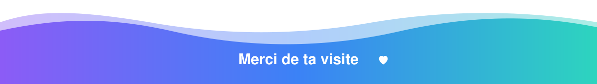

<!-- ╔═══════════════════════════════ HEADER ═══════════════════════════════╗ --> 
   
  
     

  <!-- ╔═══════════════════════════════ À PROPOS ═══════════════════════════════╗ -->
💜 Qui suis-je ?

Je m'appelle Corentin, alias AyZann. Développeur polyvalent et curieux insatiable, j'apprends vite et je transforme des idées complexes en outils concrets qui tournent vraiment.
Bots Discord, sites web, applications, API, automatisations, outils internes… je peux développer à peu près tout type de projet, de la première ligne de code jusqu'à la mise en production.
Je suis Co-fondateur & Lead Développeur de LUCTY, une association loi 1901 qui héberge et développe des sites, des bots et des applications à prix coûtant pour les associations, commerçants, créateurs et particuliers.
js
const ayzann = {
  nom:         "Corentin",
  role:        "Co-fondateur & Lead Developer @ LUCTY",
  profil:      "Développeur full-stack polyvalent",
  construit:   ["Bots Discord", "Sites web", "Applications", "API", "Automatisations", "Outils internes"],
  stack:       ["JavaScript", "Node.js", "PHP", "SQL", "Lua", "HTML/CSS"],
  apprend:     ["Docker 🐳"],
  philosophie: "Si ça peut se coder, je le code ⚡",
};
   <!-- ╔═══════════════════════════════ PROJETS ═══════════════════════════════╗ -->
🚀 Mes projets
<table> <tr> <td width="50%" valign="top"> <h3>🚒 <a href="https://amicalespsmj.com/">Amicale des Sapeurs-Pompiers de St-Médard-en-Jalles</a></h3>  
Le <b>plus gros projet actuel de LUCTY</b> : le site de l'amicale, une association créée en 1940 qui rassemble 165 pompiers. Conçu et développé de A à Z.
    </td> <td width="50%" valign="top"> <h3>🤖 <a href="https://discord.gg/wTKbg4uFRq">Lucty BETA</a></h3>  
Le bot officiel de la communauté <b>LUCTY</b> : modération, outils communautaires et fonctionnalités sur mesure. Bientôt disponible pour <b>tous les serveurs Discord</b>.
    </td> </tr> <tr> <td width="50%" valign="top"> <h3>☁️ <a href="https://lucty.fr/">LUCTY</a></h3>  
Association d'<b>hébergement</b> (bots, sites, API dès 1 €/mois) et de <b>développement sur mesure</b>. Zéro salaire, zéro marge, tout est réinvesti dans l'infrastructure.
   </td> <td width="50%" valign="top"> <h3>🛰️ <a href="https://github.com/CocoCrypt/DISPATCH-PRO">Dispatch Pro</a></h3>  
Bot Discord qui automatisait l'administration des serveurs <b>GTA RP</b> : prises et fins de service, pauses et calcul des heures hebdomadaires.
    </td> </tr> </table>  <!-- ╔═══════════════════════════════ STACK ═══════════════════════════════╗ -->
🛠️ Stack technique

💻 Langages & Web   
<!-- 👉 Ajoute tes autres langages ici en complétant la liste i=... Exemples dispos : ts,python,react,nextjs,vue,tailwind,java,cs,cpp,go,rust,flutter,kotlin,swift,electron,mongodb,postgres,redis,linux,nginx Ex :  -->
🧰 Outils   
🌱 En cours d'apprentissage   

  <!-- ╔═══════════════════════════════ STATS ═══════════════════════════════╗ -->
📊 Mon activité

       <!-- 🐍 Serpent animé : nécessite le fichier .github/workflows/snake.yml --> 
 <picture> <source media="(prefers-color-scheme: dark)" srcset="https://raw.githubusercontent.com/CocoCrypt/CocoCrypt/output/github-snake-dark.svg"/>  </picture> 
  <!-- ╔═══════════════════════════════ CONTACT ═══════════════════════════════╗ --> 

🤝 Un projet en tête ?
Un bot, un site, une appli, une API ou un outil sur mesure ?  Parlons-en sur Discord, ou passe par LUCTY pour un hébergement et un développement à prix associatif.
  
  
 

